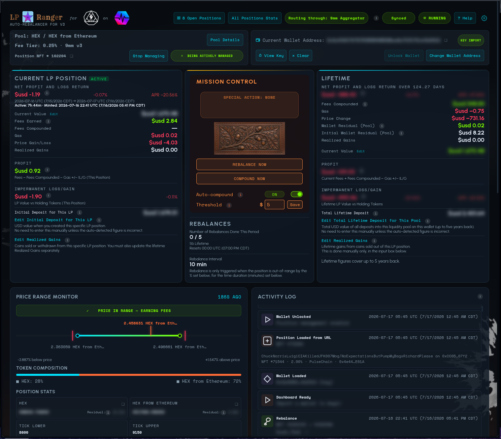
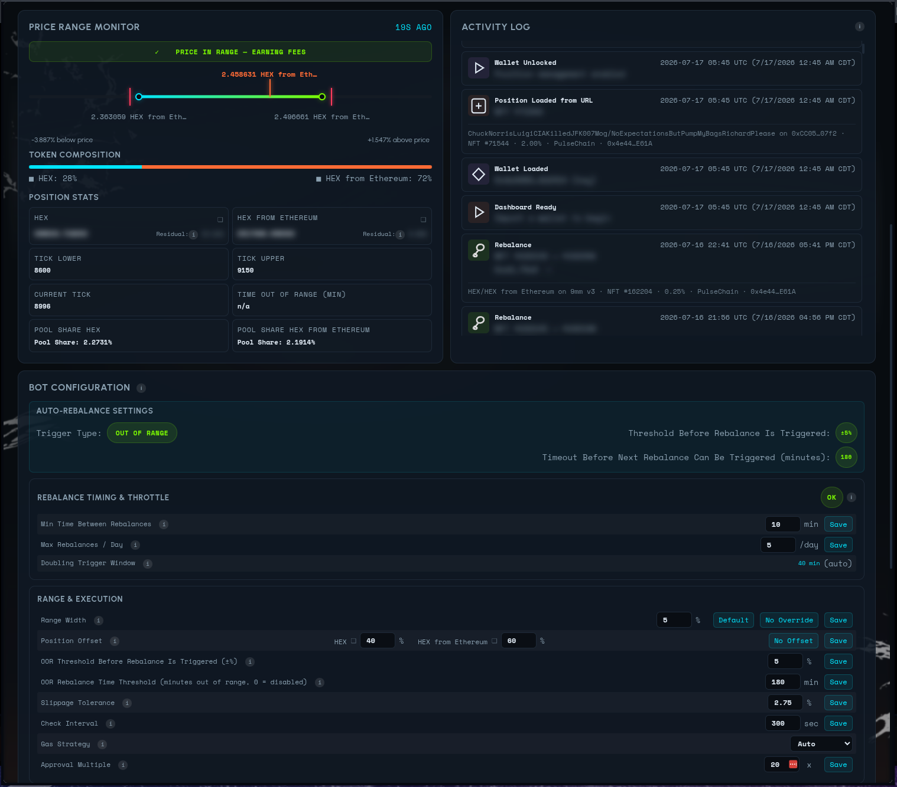
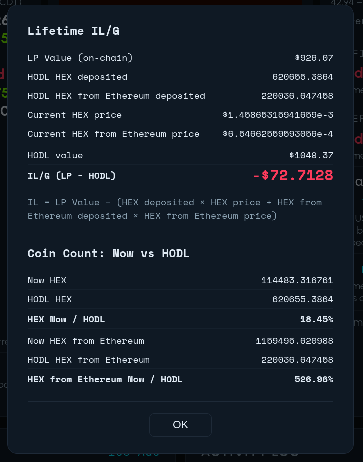
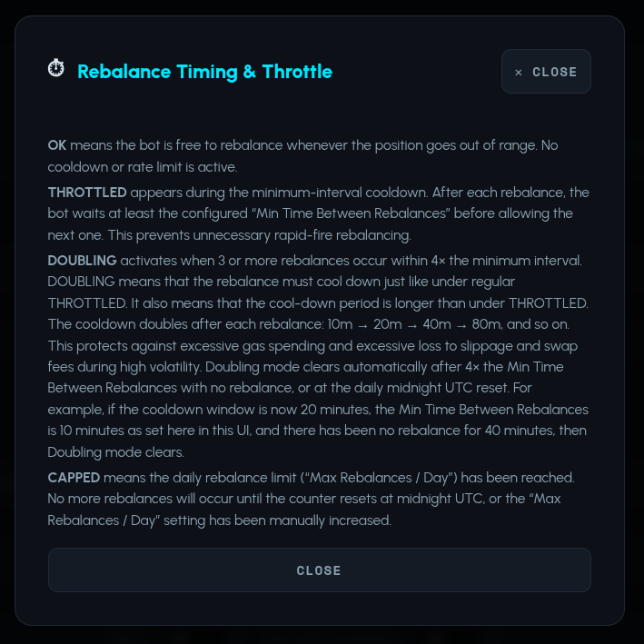
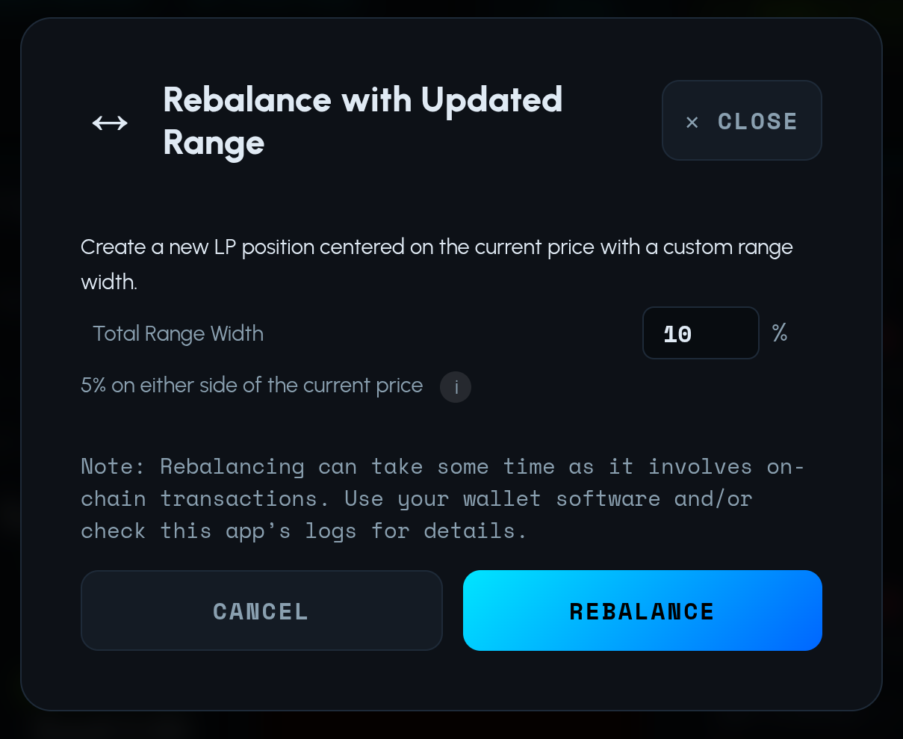
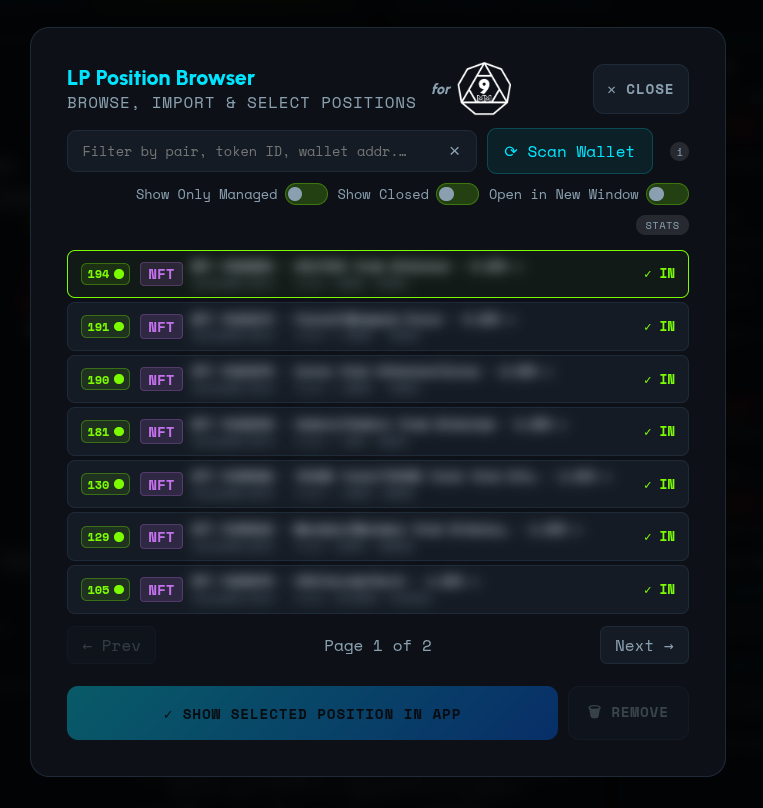
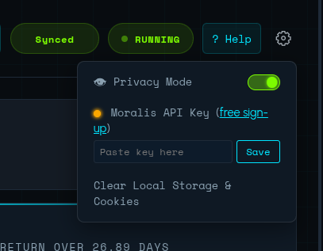
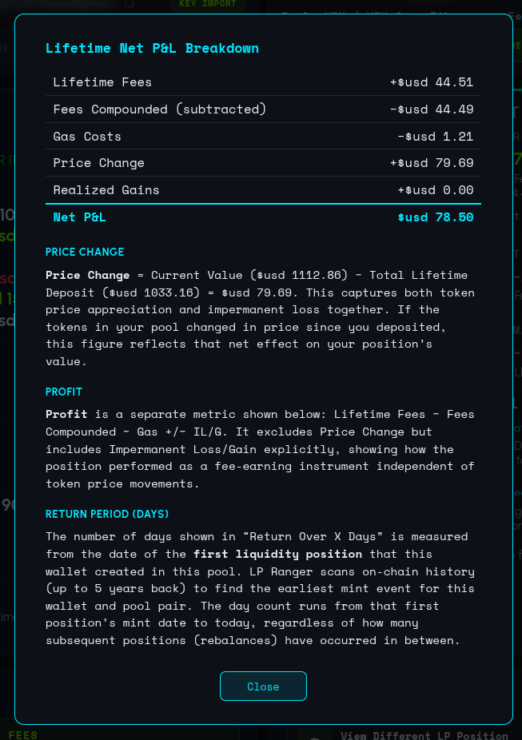
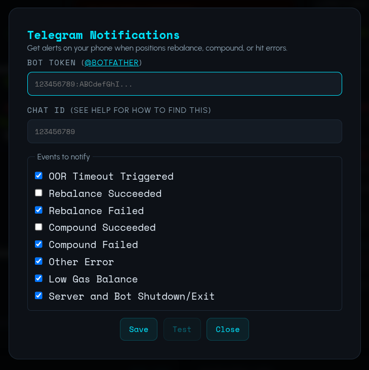
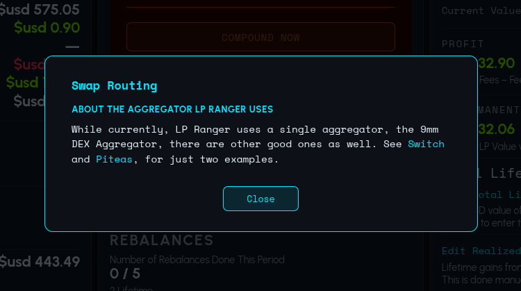

# LP Ranger - Supports 9mm v3 on PulseChain (Ethereum w/o the Bug-eating)

[](https://github.com/nottoseethesun/9mm-lp-position-manager/actions/workflows/ci.yml)
[](https://github.com/nottoseethesun/9mm-lp-position-manager/actions/workflows/ci.yml)

Auto-rebalancing concentrated liquidity manager, dedicated to simplicity, for [9mm Pro](https://9mm.pro)
(Uniswap v3 fork) on PulseChain. Manages multiple LP positions simultaneously across different pools from a single wallet, with complete P&L stats extending back up to five years per pool.

Looks back up to five years on your wallet to show you how you're doing with each liquidity pool: ***With LP Ranger, you know where you're at.***

**V3 positions only** — V2 positions are not supported.

## Table of Contents

- [Disclaimer](#disclaimer)
- [Screenshots](#screenshots)
  - [Dashboard Overview](#dashboard-overview)
  - [Configuration, P&L History, and Rebalance Events](#configuration-pl-history-and-rebalance-events)
  - [Impermanent Loss/Gain and Coin Count Stats](#impermanent-lossgain-and-coin-count-stats)
  - [Rebalance Throttling](#rebalance-throttling)
  - [Manual Rebalance](#manual-rebalance)
  - [Position Browser](#position-browser)
  - [Settings](#settings)
  - [Lifetime Net Stats](#lifetime-net-stats)
  - [Telegram Options](#telegram-options)
  - [Educational and Informative Material](#educational-and-informative-material)
- [Pre-Requisites](#pre-requisites)
- [Install](#install)
- [Uninstall](#uninstall)
- [Usage](#usage)
  - [Help and User Manual](#help-and-user-manual)
- [Lint & Test](#lint--test)
- [Private Key Security](#private-key-security)
- [Configuration & Development](#configuration--development)
- [License](#license)
- [Road Map](#road-map)
- [Contributing](#contributing)

---

## Disclaimer

This software is provided "as is", without warranty of any kind. It has not
been formally audited and may contain bugs or vulnerabilities. Transactions
executed by LP Ranger are irreversible. Do not use this software with funds
you cannot afford to lose.

A full Disclosure &mdash; covering risk, venue relationships, conflicts of
interest, fees, MEV exposure, cybersecurity, and regulatory context &mdash;
is presented to the user on every app launch and is available at any time
via Settings &rarr; Disclosure. The rendered Disclosure is published at
[nottoseethesun.github.io/lp-ranger/disclosure.html](https://nottoseethesun.github.io/lp-ranger/disclosure.html);
its HTML source is maintained at `public/disclosure.html` in this repository.

---

## Screenshots

### Dashboard Overview

Here you can see LP Ranger really doing its job! The user has rebalanced too many times. That's because the user is the dev, and there isn't a complete toolchain on testnet, so he's doing the Only Way to Fly, "Testing in Production". But you can see the impact of that on Impermanent Loss/Gain.

Click the image to see a larger version.



### Configuration, P&L History, and Rebalance Events

Click the image to see a larger version.



### Impermanent Loss/Gain and Coin Count Stats



### Rebalance Throttling



### Manual Rebalance



### Position Browser



### Settings



### Lifetime Net Stats

Cumulative P&L, fees, and gas across the full rebalance chain for a pool.



### Telegram Options

Opt in to real-time alerts for rebalances, compounds, errors, and shutdown.



### Educational and Informative Material

Click the circle-i next to any parameter for in-app help on what it does and how to tune it.



---

## Pre-Requisites

- Node.js 22+
  - Linux (including for arm64 versions of Raspberry Pi), Mac:
    1. <https://brew.sh/>
    2. <https://formulae.brew.sh/formula/node#default>
  - Windows:
    1. <https://chocolatey.org/install>
    2. <https://community.chocolatey.org/packages/nodejs-lts>
- Web browser

---

## Install

First meet the [Pre-Requisites](#pre-requisites), above.

### Production

This is the install step for anyone who isn't doing dev work on LP Ranger. That's probably you. :)

First, download the latest official release ".tar.gz" file from
[GitHub Releases](../../releases).

Second, on the commandline in your Terminal, do:

```bash
tar xvzf lp-ranger-*.tar.gz     # Recommended: Instead of the star, use the full version number
cd lp-ranger-[current-version-number]
npm ci                           # install exact pinned dependencies
# The next step is optional, and not for standard set-ups.
#    Only use it if you have a specific custom set-up in mind.
#    Uncomment the line below for a custom set-up.
# cp .env.example .env             # edit with your values
npm start                        # dashboard + bot at http://localhost:5555
```

> Note: Production releases pin every dependency to an exact version and include
> `package-lock.json`. Always use `npm ci` (not `npm install`) to ensure
> you get the exact tested versions with no version drift.

Third, prepare your crypto wallet information per the instructions in the [Usage](#usage) section here.

Finally, visit <http://localhost:5555> in your web browser.

### Development

```bash
git clone <repo-url>
cd lp-ranger
npm install                      # allows version ranges for dev flexibility
cp .env.example .env             # edit with your values
npm run dev                      # build + watch mode
```

---

## Uninstall

**Step One** — Open the LP Ranger dashboard in your web browser as usual
(e.g. `http://localhost:5555`).

**Step Two** — Stop the server:

```bash
cd lp-ranger-[current-version-number]
# Press Ctrl+C in the terminal where the server is running.
# Wait for the server to stop gracefully.
# If it does not stop, press Ctrl+C again.
```

**Step Three** — Clear browser data:

&emsp;Click the **Settings** gear icon at top right in the LP Ranger app and click **"Clear Local Storage & Cookies"**.

**Step Four** — Remove the directory:

```bash
cd ..
rm -rf lp-ranger*
```

---

## Usage

1. Pick a wallet address that you own (it can be a new address that LP Ranger will generate for you later, if you want it to) and that you will use exclusively for LP Ranger activity (manual interactions with the dApps of supported DEX Pools, such as the 9mm Liquidity Manager, are okay as well). This kind of wallet segregation is a security best-practice. Separately but as well, this will ensure that LP Ranger's Lifetime Net Profit and Lifetime Impermanent Loss/Gain (IL/G) numbers are correct.
2. Ensure that you either plan to use a brand new wallet address that LP Ranger will create for you if you so choose, or that you have either the Seed Phrase or Private Key of an existing wallet address if you plan to use an existing one.
3. If you will be using a pre-existing wallet address: If you don't have any 9mm V3 Liquidity Positions on that wallet address, then create one at <https://dex.9mm.pro/liquidity>, making sure to use V3. Otherwise, go back to this step after Step 4, and then click on "Scan Wallet" on the LP Ranger App, in the LP Browser dialog (click the "Positions" button on the app, near top middle).
4. Visit <http://localhost:5555> in your web browser.
5. See the first paragraph in the Help text on the app (click at top right on the app).

### Help and User Manual

**[View the full Help and User Manual](https://nottoseethesun.github.io/lp-ranger/help.html)**

---

## Lint & Test

```bash
npm run lint                 # ESLint — 0 errors, 0 warnings
npm test                     # Node.js built-in test runner
npm run check                # lint + test (matches CI)
```

---

## Private Key Security

The bot supports **encrypted at-rest key storage** as an alternative to placing
a raw private key in `.env`. Keys are encrypted with AES-256-GCM using a
password-derived key (PBKDF2-SHA-512, 600 000 iterations) and stored as a JSON
file on disk. The raw key is never written to disk unencrypted.

To use this, set `KEY_FILE` in your `.env` instead of `PRIVATE_KEY`. For best
security, leave `KEY_PASSWORD` blank — the bot will prompt you interactively at
startup so the password is never saved to disk.

**WARNING:** If you lose your password, the encrypted key file **cannot** be
recovered. There is no password reset. You will need to re-enter your private
key or seed phrase to create a new encrypted file. Always keep a secure backup
of your private key or seed phrase independently.

See `src/key-store.js` for details and `.env.example` for the template.

---

## Configuration & Development

For an overview of LP Ranger's architecture — how the bot and dashboard
interact, the rebalance pipeline, P&L tracking, and security model — see
**[`docs/architecture.md`](docs/architecture.md)**.

**For all details** — environment variables, contract addresses, pricing API
setup, development tools, the `app-config/` layout, and the check-report
pipeline — see **[`docs/engineering.md`](docs/engineering.md)**.  That is the
authoritative engineering reference for this project.

See also: [`.env.example`](.env.example) for a ready-to-copy configuration
template.

---

## License

Licensed under the Apache License, Version 2.0. See [LICENSE](LICENSE) for the
full text.

---

## Road Map

Planned features for future releases:

- **Multi-chain support** — add support for 9mm on Ethereum, and after that, the other blockchains that 9mm supports.
- **LP Optimization Engine** — integrate with an external optimization service that recommends optimal range width, rebalance timing, and fee tier based on historical pool data and volatility analysis.

---

## Contributing

Bug reports and ideas for new features and improvements are welcome. Use the [Issues](https://github.com/nottoseethesun/9mm-lp-position-manager/issues) tab.

Due to security being the highest priority, only contributions that have been formally audited for security can be considered for acceptance.
