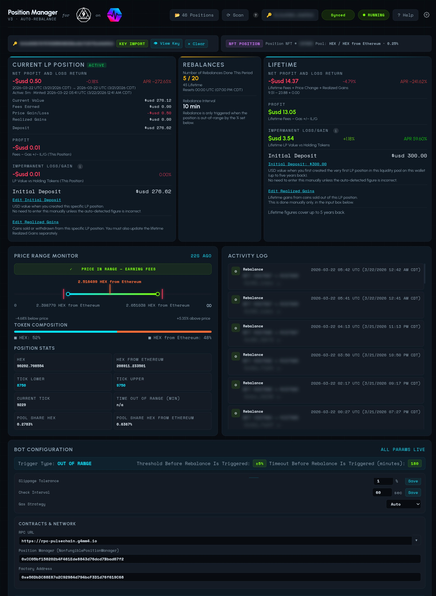
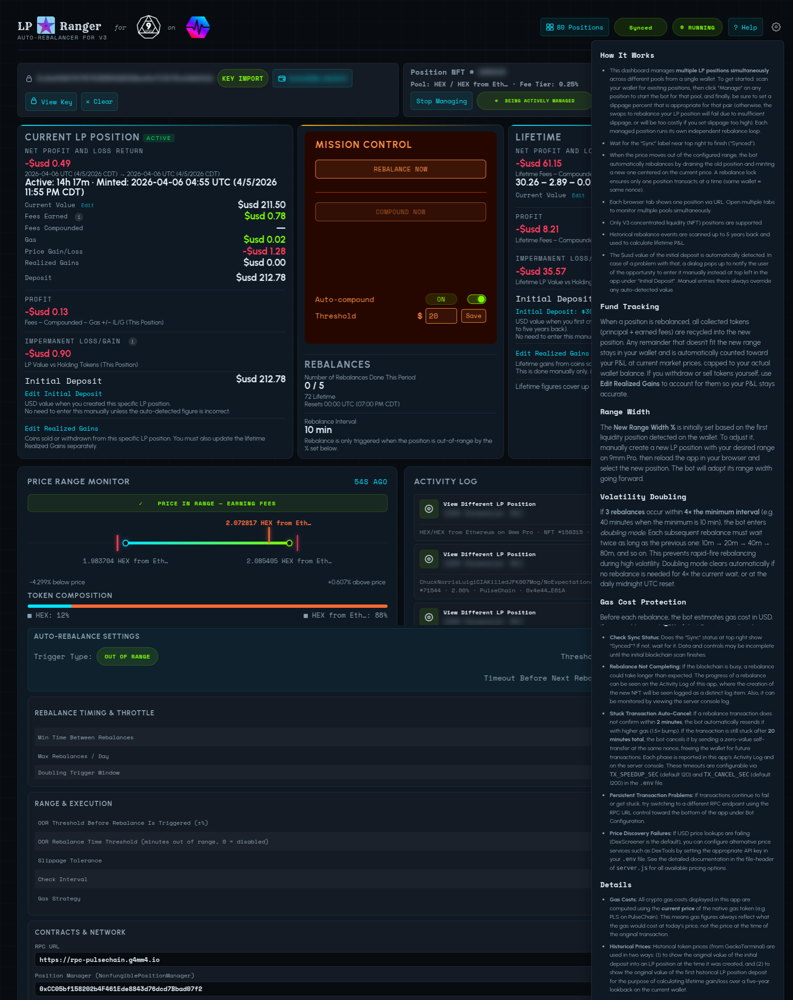
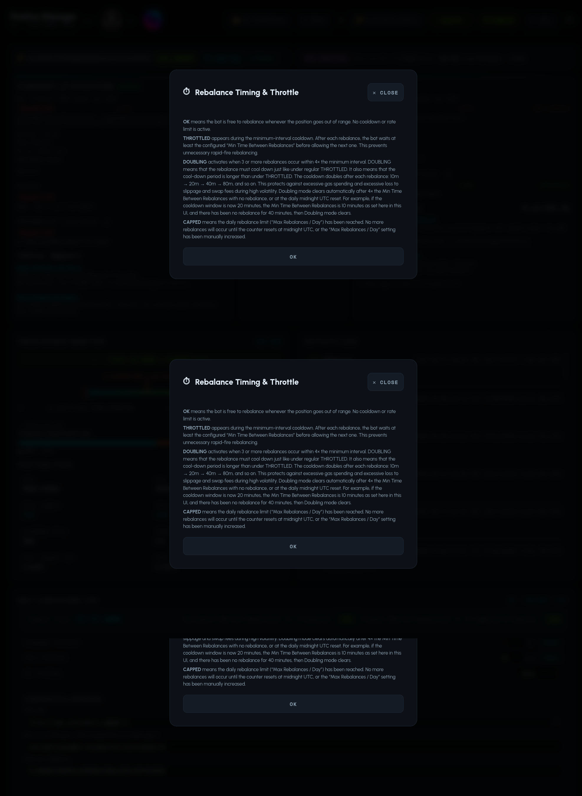
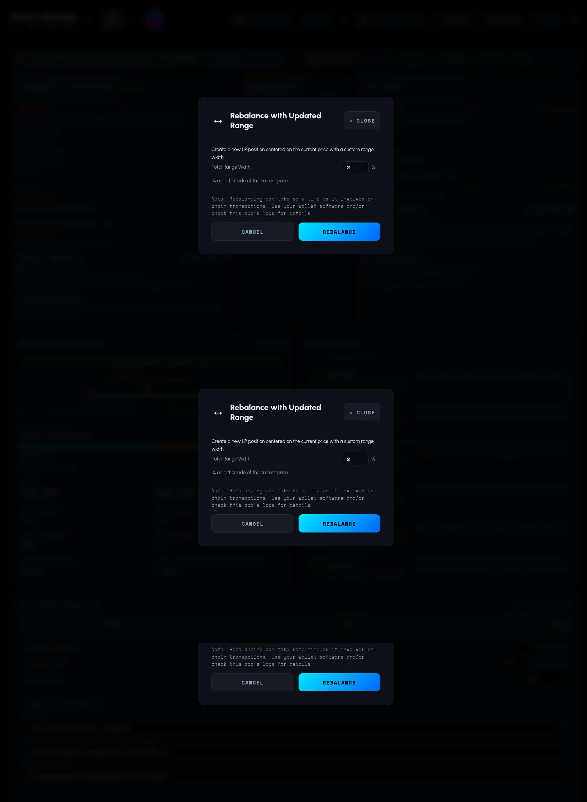
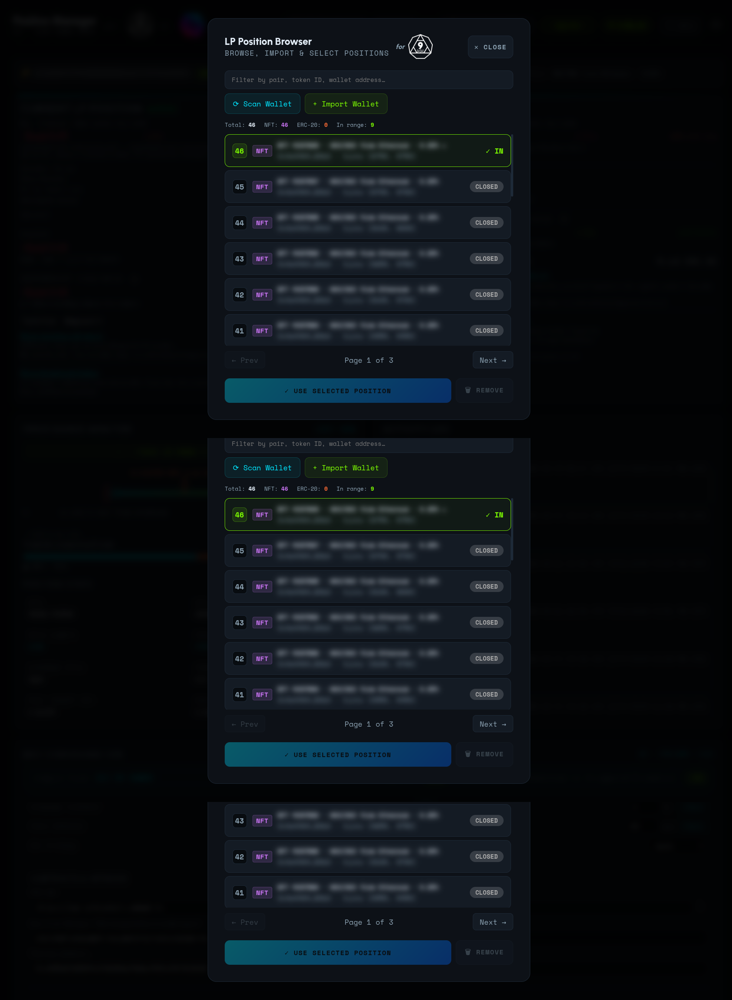
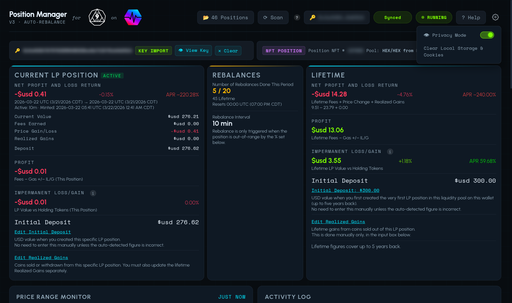

# Position Manager for 9mm v3

[](https://github.com/nottoseethesun/9mm-lp-position-manager/actions/workflows/ci.yml)
[](https://github.com/nottoseethesun/9mm-lp-position-manager/actions/workflows/ci.yml)

Auto-rebalancing concentrated liquidity manager, dedicated to simplicity, for [9mm Pro](https://9mm.pro)
(Uniswap v3 fork) on PulseChain, with complete P&L stats extending back up to five years for a single liquidity pool on a given wallet address.

Looks back up to five years on your wallet to show you how you're doing with a given liquidity pool: With Position Manager, you know where you're at.

**V3 positions only** — V2 positions are not supported.













---

## DISCLAIMER

**USE AT YOUR OWN RISK.** THIS SOFTWARE IS PROVIDED "AS IS", WITHOUT WARRANTY
OF ANY KIND, EXPRESS OR IMPLIED, INCLUDING BUT NOT LIMITED TO THE WARRANTIES OF
MERCHANTABILITY, FITNESS FOR A PARTICULAR PURPOSE, AND NONINFRINGEMENT. IN NO
EVENT SHALL THE AUTHORS, COPYRIGHT HOLDERS, OR CONTRIBUTORS BE LIABLE FOR ANY
CLAIM, DAMAGES, OR OTHER LIABILITY, WHETHER IN AN ACTION OF CONTRACT, TORT, OR
OTHERWISE, ARISING FROM, OUT OF, OR IN CONNECTION WITH THE SOFTWARE OR THE USE
OR OTHER DEALINGS IN THE SOFTWARE.

**BY USING THIS SOFTWARE, YOU ACKNOWLEDGE AND AGREE THAT:**

1. You are solely responsible for any and all financial losses, including but
   not limited to loss of cryptocurrency, tokens, or other digital assets,
   that may result from the use or misuse of this software.
2. This software interacts with decentralized protocols and smart contracts on
   public blockchains. Transactions are irreversible. The authors have no
   ability to recover lost funds.
3. This software has not been formally audited. It may contain bugs, errors, or
   vulnerabilities that could result in partial or total loss of funds.
4. You assume full responsibility for evaluating the risks associated with
   using this software, including but not limited to smart contract risk,
   impermanent loss, slippage, MEV (miner/maximal extractable value) attacks,
   oracle failures, and network congestion.
5. You are responsible for complying with all applicable laws and regulations
   in your jurisdiction, including but not limited to tax obligations and
   securities regulations.
6. The authors and contributors expressly disclaim any fiduciary duty or
   advisory relationship with users of this software.

**DO NOT USE THIS SOFTWARE WITH FUNDS YOU CANNOT AFFORD TO LOSE.**

---

## Pre-requisites

- Node.js 20+
- Web browser

---

## Quick Start

```bash
git clone <repo-url>
cd 9mm-manager
npm install
cp .env.example .env        # edit with your values
npm run build-and-start      # dashboard + bot at http://localhost:5555
```

---

## Usage

See the first paragraph in the Help text on the app (click at top right on the app).

---

## Lint & Test

```bash
npm run lint                 # ESLint — 0 errors, 0 warnings
npm test                     # Node.js built-in test runner
npm run check                # lint + test (matches CI)
```

---

## Private Key Security

The bot supports **encrypted at-rest key storage** as an alternative to placing
a raw private key in `.env`. Keys are encrypted with AES-256-GCM using a
password-derived key (PBKDF2-SHA-512, 600 000 iterations) and stored as a JSON
file on disk. The raw key is never written to disk unencrypted.

To use this, set `KEY_FILE` in your `.env` instead of `PRIVATE_KEY`. For best
security, leave `KEY_PASSWORD` blank — the bot will prompt you interactively at
startup so the password is never saved to disk.

**WARNING:** If you lose your password, the encrypted key file **cannot** be
recovered. There is no password reset. You will need to re-enter your private
key or seed phrase to create a new encrypted file. Always keep a secure backup
of your private key or seed phrase independently.

See `src/key-store.js` for details and `.env.example` for the template.

---

## Configuration & Development

**For all details** — environment variables, contract addresses, pricing API
setup, development tools, and architecture — see the file-header JSDoc of
**[`server.js`](server.js)**.  That is the authoritative reference for this
project.

See also: [`.env.example`](.env.example) for a ready-to-copy configuration
template.

---

## License

Licensed under the Apache License, Version 2.0. See [LICENSE](LICENSE) for the
full text.

Currently, only supports liquidity positions on a single liquidity pool per wallet. Support for multiple liquidity pools on one wallet is planned. Currently, one LP position is selected for a given wallet, and P&L is tracked for only that liquidity pool.

---

## Road Map

Planned features for future releases:

- **Near Edge Trigger** — trigger a rebalance when the current price approaches the edge of the active range (configurable threshold), rather than waiting until out of range.
- **LP Optimization Engine** — integrate with an external optimization service that recommends optimal range width, rebalance timing, and fee tier based on historical pool data and volatility analysis.
- **Multiple Pools per Wallet** — manage LP positions across multiple liquidity pools from a single wallet, with per-pool P&L tracking.
